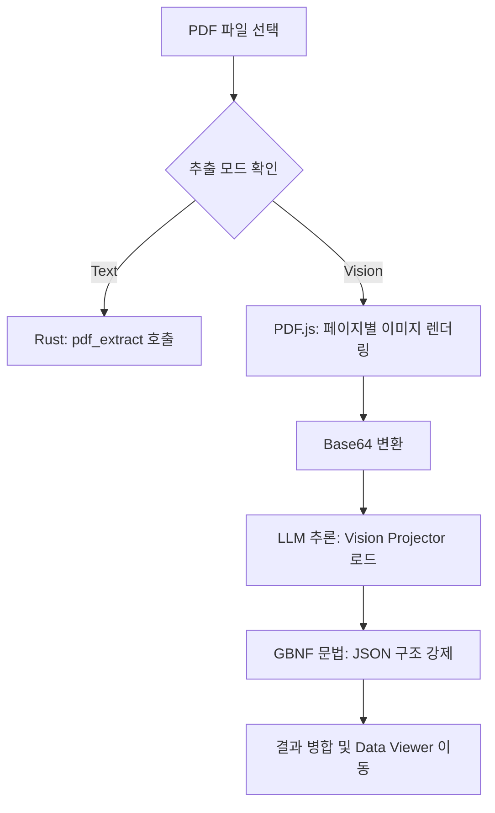

# 소프트웨어 아키텍처 명세서 (Architecture Specification)

본 문서는 AI PDF Parser의 시스템 설계, 프로세스 관리 메커니즘 및 데이터 흐름을 상세히 설명합니다.

## 1. 2-Layer 프로세스 아키텍처

AI PDF Parser는 UI/비즈니스 로직을 담당하는 **Tauri 기반 메인 앱**과 LLM 추론을 담당하는 **`llama-server` 서브 프로세스**로 구성된 2-Layer 구조를 채택합니다.

### 1.1 서브 프로세스 격리 및 제어
- **Windows Job Object**: `llm_runner.rs`는 Windows API를 사용하여 전용 Job Object를 생성합니다. 메인 앱(Tauri) 프로세스가 예기치 않게 종료되더라도, OS 수준에서 `llama-server` 프로세스를 즉시 강제 종료하여 VRAM 및 CPU 리소스 유실을 완벽히 방지합니다.
- **리소스 경로 해결**: 앱 실행 시 `app_handle.path().resolve()`를 통해 실행 환경(Dev/Prod)에 맞는 바이너리 경로를 동적으로 탐색하며, 실패 시 3단계의 Fallback 경로(ResourceDir -> CurrentDir -> SrcTauriDir)를 순차적으로 확인합니다.

## 2. Vision 멀티모달 파이프라인

Vision 모드 활성화 시, 시스템은 텍스트 기반 추출과는 다른 정교한 시퀀셜 파이프라인을 가동합니다.



### 2.1 GBNF (Grammar-Based Native Formats)
- 추출 결과의 일관성을 위해 GBNF 문법을 사용합니다. 이는 LLM이 응답 시 사전에 정의된 JSON 스키마를 100% 준수하도록 강제하여 파싱 에러를 근본적으로 차단합니다.

## 3. 데이터 영속성 및 설정 관리

### 3.1 계층적 설정 스택
시스템은 사용자의 편의성을 위해 설정을 두 가지 계층으로 관리합니다.

1.  **전역 설정 (Global Settings)**: `settings.json`에 저장되는 기본 UI 테마, 다운로드 경로, 서버 포트 등.
2.  **모델별 설정 (Per-Model Settings)**: 특정 모델(`{model_name}_setting.json`) 전용 스냅샷. 사용자가 모델을 변경할 때 해당 모델에 최적화된 Temperature, NGL, 프롬프트 등이 즉시 오버라이드됩니다.

### 3.2 상태 복원 가드 (`isInitializing`)
- 앱 시작 시 `Zustand` 스토어와 `Tauri Store` 간의 동기화 과정에서 초기 설정이 기본값으로 덮어씌워지는 것을 방지하기 위해 `isInitializing` 플래그를 사용합니다. 동기화가 완료된 후에만 영속성 쓰기 작업이 허용됩니다.

## 4. 리소스 모니터링 체계

- **CPU/RAM**: `sysinfo` 라이브러리를 통해 1초 단위로 시스템 부하를 모니터링합니다.
- **GPU (VRAM)**: NVIDIA 환경의 경우 `nvidia-smi --query-gpu` 명령어를 서브 프로세스로 호출하여 실시간 사용량을 획득합니다. 획득된 데이터는 하단 `GlobalStatusBar`를 통해 사용자에게 즉각 피드백됩니다.

## 5. 프로젝트 구조

```text
src/
├── api/             # HTTP 기반 LLM 스트리밍 API
├── components/      # UI 컴포넌트 (Shadcn UI)
├── pages/           # 화면 단위 컴포넌트 (Home, Viewer, Settings)
├── store/           # Zustand 기반 상태 관리 및 영속성 로직
└── lib/             # 유틸리티 함수 (JSON 추출, 하이라이팅 등)

src-tauri/
├── src/
│   ├── main.rs      # 진입점
│   ├── lib.rs       # 주요 IPC 핸들러
│   └── llm_runner.rs # llama-server 제어 및 Job Object 관리
└── resources/bin/   # 런타임별(cpu, vulkan, cuda12) 바이너리 저장소
```
